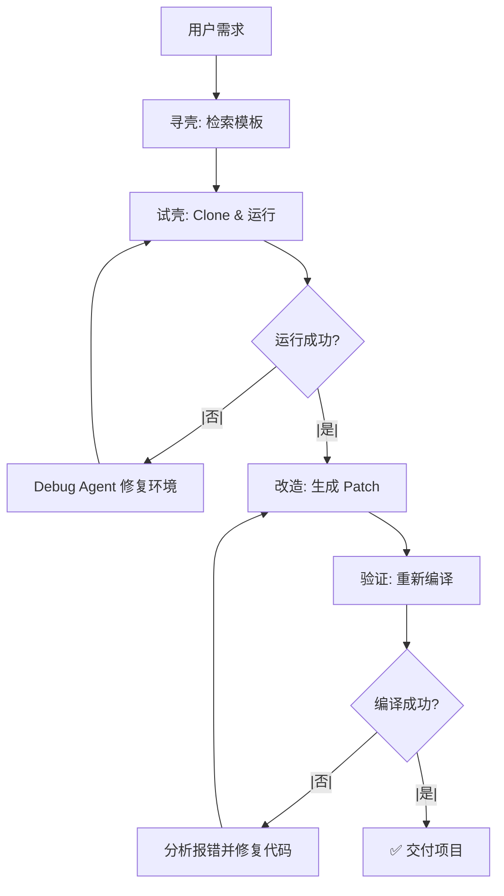

# 🦀 PaGURUS (寄居蟹) 项目概念文档

> **Execution-Guided Repository-Level Code Agent**  
> 基于执行反馈与模板检索的仓库级代码智能体

---

## 💡 核心理念

**Clone → Build → Tweak**  
拒绝 Zero-shot，站在开源库的肩膀上写代码

**"找壳 → 钻壳 → 改壳"**  
像寄居蟹一样，在现有优秀项目的基础上进行增量开发，而非从零开始生成

---

## 🎯 定位与价值

| 传统方式 | PaGURUS 方式 |
|---------|-------------|
| ❌ Zero-shot 生成，代码质量不可控 | ✅ 基于成熟模板，质量有保障 |
| ❌ 无法运行验证，生成即结束 | ✅ 沙盒执行验证，闭环修复 |
| ❌ 缺乏项目结构意识 | ✅ 理解仓库全局依赖关系 |
| ❌ 环境配置错误频发 | ✅ 自动调试环境直至跑通 |

---

## 🏗️ 系统架构

```
┌─────────────────────────────────────────────────────────────────┐
│                        用户需求输入                              │
│  "帮我写一个带登录功能的 React 个人博客，后端用 FastAPI"         │
└────────────────────────────┬────────────────────────────────────┘
                             │
                             ▼
┌─────────────────────────────────────────────────────────────────┐
│  ① 意图解析与"寻壳"模块 (Retriever)                              │
│  ┌─────────────────────────────────────────────────────────┐   │
│  │ • 需求拆解 → 技术栈标签                                  │   │
│  │ • 模板库检索 → 匹配最佳骨架项目                          │   │
│  │ • 初期: 50个精选模板 JSON 库                            │   │
│  │ • 后期: GitHub API + Qdrant 向量检索                    │   │
│  └─────────────────────────────────────────────────────────┘   │
└────────────────────────────┬────────────────────────────────────┘
                             │
                             ▼
┌─────────────────────────────────────────────────────────────────┐
│  ② 沙盒"试壳"模块 (Sandbox & Execution Builder)                 │
│  ┌─────────────────────────────────────────────────────────┐   │
│  │ • Clone 目标项目到隔离环境                              │   │
│  │ • 自动安装依赖并尝试启动                                │   │
│  │ • 环境冲突自动修复 (Docker/E2B)                         │   │
│  │ • Debug Sub-Agent: 循环读取 Log 并修复                  │   │
│  └─────────────────────────────────────────────────────────┘   │
└────────────────────────────┬────────────────────────────────────┘
                             │
                             ▼
┌─────────────────────────────────────────────────────────────────┐
│  ③ 代码"改造"模块 (AST-based Code Modifier)                     │
│  ┌─────────────────────────────────────────────────────────┐   │
│  │ • Tree-sitter 解析 → 仓库全局依赖图 (Repo Map)          │   │
│  │ • 理解项目结构，定位修改文件                             │   │
│  │ • LLM 生成精准 Patch (参考 Aider)                       │   │
│  │ • 增量开发，保持原有架构风格                            │   │
│  └─────────────────────────────────────────────────────────┘   │
└────────────────────────────┬────────────────────────────────────┘
                             │
                             ▼
┌─────────────────────────────────────────────────────────────────┐
│  ④ 验证与输出模块 (Validator)                                    │
│  ┌─────────────────────────────────────────────────────────┐   │
│  │ • 沙盒重新编译运行                                       │   │
│  │ • 报错 → 反馈给模块③自修复                               │   │
│  │ • 成功 → 打包交付完整项目                                │   │
│  └─────────────────────────────────────────────────────────┘   │
└─────────────────────────────────────────────────────────────────┘
```

---

## 🔄 核心工作流



### 详细步骤

| 步骤 | 名称 | 动作 | 输出 |
|-----|------|------|------|
| 1 | **User Request** | 用户输入需求 Prompt | 需求描述 |
| 2 | **Search & Clone** | 检索并拉取目标 Repo | 项目代码 |
| 3 | **Init & Test** | 启动沙盒，执行 setup | 环境状态 |
| 4 | **Debug Loop** | 循环阅读报错并修复依赖 | 可运行环境 |
| 5 | **Plan & Navigate** | 结合 Repo Map 制定修改计划 | 修改方案 |
| 6 | **Code & Patch** | LLM 输出 Diff 并应用 | 代码补丁 |
| 7 | **Verify** | 重新编译验证 | 运行结果 |
| 8 | **Deliver** | 打包并交付 | 完整项目 |

---

## 🛣️ 研发演进路线

### Phase 1: 概念验证 (PoC) - 1周

```
目标: 证明"模板+修改"比"从零生成"质量高
```

- [ ] 写死 1-2 个熟悉模板 (如纯 Python 脚本框架)
- [ ] 使用 subprocess 调用命令行跑通环境
- [ ] 拼接项目源码 + 需求，让 LLM 输出修改代码并覆盖

**成功标准**: 能够在一个固定模板上完成简单的增量修改

---

### Phase 2: 闭环实现 (MVP) - 1个月

```
目标: 实现完整的自动化工作流
```

- [ ] 引入 Docker/E2B 沙盒，实现环境隔离
- [ ] 接入基础 RAG，支持 10 个预设模板自动选择
- [ ] 实现 AST 代码理解 (Repo Map)
- [ ] 实现基于 Diff 的精准代码修改

**成功标准**: 用户输入需求 → 自动输出可运行项目

---

### Phase 3: 智能体强化 - 2-3个月

```
目标: 攻克核心技术难点，达到研究级别
```

- [ ] **环境依赖报错的自主修复率** > 80%
- [ ] **长上下文多文件修改的一致性** 优化
- [ ] 接入 GitHub API，扩展模板库至 1000+
- [ ] 引入 Qdrant 向量检索，提升匹配准确率

**成功标准**: 可在 SWE-bench 打榜，或发表相关论文

---

## 🔬 研究价值与创新点

### 1. **执行反馈驱动**
- 传统 Agent: 纯静态代码生成
- **PaGURUS**: 真实执行验证，闭环反馈修复

### 2. **仓库级理解**
- 传统 Agent: 单文件或零散片段
- **PaGURUS**: Repo Map 全局依赖图，结构化修改

### 3. **模板优先策略**
- 传统 Agent: Zero-shot 盲目生成
- **PaGURUS**: 站在巨人肩膀上，质量有底线

### 4. **环境自主修复**
- 传统 Agent: 无法处理环境问题
- **PaGURUS**: 专门的 Debug Sub-Agent 循环修复

---

## 📊 与现有方案的对比

| 特性 | GitHub Copilot | Aider | Cursor | **PaGURUS** |
|-----|---------------|-------|--------|-------------|
| 模板检索 | ❌ | ❌ | ❌ | ✅ |
| 环境自动修复 | ❌ | ❌ | ❌ | ✅ |
| 仓库级理解 | ❌ | ✅ | ✅ | ✅ |
| 执行验证 | ❌ | ❌ | ❌ | ✅ |
| 增量开发 | ✅ | ✅ | ✅ | ✅ |
| 多文件协作 | ⚠️ | ✅ | ✅ | ✅ |

---

## 🚀 快速开始

```bash
# 理念示例: 如何用 PaGURUS 创建一个博客

# ① 找壳: 检索匹配的模板
用户: "创建一个 React + FastAPI 的博客系统"
PaGURUS: 找到 awesome-react-fastapi-starter

# ② 钻壳: 克隆并运行
PaGURUS: 
   - Clone 项目
   - npm install (3次重试后成功)
   - python -m pip install -r requirements.txt
   - 启动服务 ✓

# ③ 改壳: 增量开发
PaGURUS:
   - 分析项目结构
   - 添加 BlogList 组件
   - 添加登录 API
   - 验证编译 ✓

# ✅ 交付: 可运行的项目
```

---

## 📚 核心技术栈

| 模块 | 技术选型 |
|-----|---------|
| 沙盒环境 | Docker / E2B |
| 代码解析 | Tree-sitter |
| 向量检索 | Qdrant |
| LLM 接口 | Claude 3.5 Sonnet / DeepSeek Coder |
| Diff 生成 | 参考 Aider 格式 |
| 依赖管理 | subprocess + poetry/npm |

---

## 🎓 为什么叫 "PaGURUS"?

> 寄居蟹的一生都在寻找、钻入、改造合适的壳。
> 
> PaGURUS 也一样：**找壳** (检索模板) → **钻壳** (跑通环境) → **改壳** (增量开发)
> 
> 这不是退步，而是站在开源生态的肩膀上，让每一行代码都有据可依。

---

*文档版本: v1.0*  
*最后更新: 2026-04-07*
